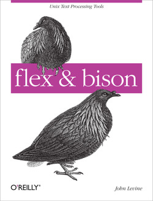

### Flex Bison

This is the code for the O'Reilly book [_flex & bison_](https://www.oreilly.com/library/view/flex-bison/9780596805418/) by John Levine.

Original code at ftp://ftp.iecc.com/pub/file/flexbison.zip.

[`flex`](https://github.com/westes/flex) and [`bison`](https://www.gnu.org/software/bison/) website.

- Three sections separated by '%%':
  - Definitions Section
  - Rules Section
  - User Code Section
- `flex` is not matching my patterns in the same order that I defined them.
  - `flex` picks the rule that matches the most text (i.e. the longest possible input string).
- `flex` breaks a tie by preferring longer matches, and if two patterns match the same thing, it prefers the pattern that appears first in the flex program. This is an utter hack, but a very useful one we'll see frequently.
- Each pattern in the Rules Section must start at the beginning of the line, since flex considers any line that starts with whitespace to be code to be copied into the generated C program.
- In the declaration section, code inside of %{ and %} is copied through verbatim near the beginning of the generated C source file.
- If action code returns, scanning resumes on the next call to yylex(); if it doesn't return, scanning resumes immediately (typically used for comments).
- yyin
- yyout
- yylex() → The name that flex gives to the scanner (co-)routine.
- yyparse()
- yytext → In any `flex` action, the variable yytext is set to point to the input text that the pattern just matched.
- yyleng → length of current token
- yywrap() 〉[called when reached EOF, returns non-zero to indicate that no further files need process processing; obsolete] → use: %option noyywrap
- void yyrestart(FILE \*new_file) → may be called to point yyin at a new input file
- YY_BUFFER_STATE yy_create_buffer (FILE \*file, int size) → used for multiple input files
- yylval 〉The token's value. The yylval global variable is used to pass the semantic value associated with a token from the lexer to the parser.
- yyerror() → There is a default implementation provided by the library, but you can write your own.
  - default implementation: int yyerror (char const \*);
- yylineno: flex provides this global variable for tracking line numbers. You are responsible for its management.
- %option nodefault → no default rule for unmatched input (recommended!)
- %s or %x (start conditions; inclusive/exclusive): inclusive → rules with no start conditions at all will also be active
  - In effect, the state defines a different scanner, with its own rules.
  - flex always defines INITIAL state
  - Exclusive states are usually more useful.
  - In action code, the macro BEGIN switches to a different start state.
  - Patterns are tagged with start state names in angle brackets to indicate in which state(s) the pattern is active.
- input() reads the next character from the input stream, e.g. to eat up C comments
- There are a number of special directives which can be included within an action:
  - ECHO: copies yytext to the scanner's output.
- yyterminate()
- %option yylineno :
  The %yylineno option tells flex to define an integer variable called yylineno and to
  maintain the current line number in it. What that means is that every time the scanner
  reads a newline character, it increments yylineno, and if the scanner backs up over a
  newline (using some features we’ll get to later), it decrements it. It’s still up to you to
  initialize yylineno to 1 at the beginning of each file and to save and restore it if you’re
  handling include files.
- %option case-insensitive
- An action consisting solely of a vertical bar ("|") tells flex that the action for this rule is the same as the action for the next rule.
- Named patterns; expand with {ame}
- /_..._/ is a comment, // is not!, comment must be indented by at least one space!
- flex: 16K buffer limit
- bison: default action → $$ = $1;
- bison: A %start declaration identifies the top-level rule, so we don’t have to put it at the beginning of the parser.
- bison: e.g. definition of a recursive data structure, e.g. a list:
  - right recursive → stmt ; list rather
  - left recursive → list stmt ;
